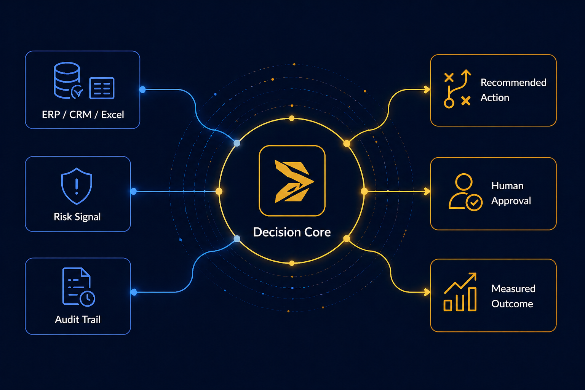

# Decigent.com Analiz ve Hero Notlari

Tarih: 26 Nisan 2026

Bu dokuman, Decigent.com icin logo ve kurumsal kimlik kilavuzu dikkate alinarak yapilan analizleri, kurumsal musteri bakis acisini, hero bolumu icin alinan kararları ve uygulanan degisiklikleri ozetler.

## 1. Kurumsal Kimlik Esaslari

Decigent markasi; kurumsal karar sureclerini ve operasyonlari yapay zeka destekli akilli is akislar ile guclendiren bir teknoloji markasi olarak konumlanir.

Marka algisi:

- Guvenilir
- Stratejik
- Teknik olarak guclu
- Sade
- Kurumsal
- Abartisiz, ozguvenli ve profesyonel

Ana mesaj:

```text
Decision intelligence and agentic operations solutions for enterprises.
```

Turkce karsilik:

```text
Kurumsal kararlar ve operasyonlar icin yapay zeka destekli akilli cozumler.
```

Renk sistemi:

- Deep Navy: `#0D1B2A`
- Decigent Gold: `#D4A017`
- Tech Blue: `#2776EA`
- Soft White: `#F7F9FC`
- Slate Gray: `#6B7280`

Tipografi:

```css
Science Gothic SemiBold, Inter, Aptos, Arial, sans-serif
```

Logo kullaniminda dikkat:

- Koyu lacivert zemin uzerinde gold + beyaz versiyon en guclu kurumsal etkiyi verir.
- Acik zeminde lacivert/gold dengesi korunmalidir.
- Logo rastgele siyah/gri varyantlarla kullanilmamalidir.
- Logoya efekt, glow, rastgele degrade veya golge eklenmemelidir.

## 2. Ilk Site Analizi

Genel kanaat:

Site marka ozune genel olarak uyumluydu, ancak kurumsal musteri iknasi icin yeterli kanit ve somutluk katmani eksikti.

Guclu taraflar:

- Konumlandirma dogruydu: karar destek, operasyon, AI workflow, insan onayi, izlenebilirlik.
- 90 gun / hizli pilot vaadi kurumsal musteri icin somuttu.
- Uretim, satis, satin alma ve IK gibi use case alanlari dogru secilmisti.
- Tasarim fazla gosterisli degildi; B2B guven algisi icin olumlu bir baslangicti.
- "Arac degil sonuc" yaklasimi ayrisma potansiyeli tasiyordu.

Zayif taraflar:

- Kanit eksikti: musteri logosu, pilot ornegi, vaka, metrik, demo ekrani veya surec ciktisi yoktu.
- Teslim edilen seyin formati belirsizdi: danismanlik mi, ozel yazilim mi, SaaS mi, entegrasyon paketi mi?
- Guvenlik ve uyumluluk yuzeyseldi: KVKK, veri saklama, rol bazli yetki, audit log, private cloud/on-prem gibi konular gorunmuyordu.
- Use case bolumu katalog gibi duruyordu; problem, cozum, cikti ve basari metrigi yapisina ihtiyac vardi.
- Mailto tabanli iletisim formu kurumsal musteri icin erken asama hissi verebilirdi.
- Blog gercek icerik yerine placeholder / LinkedIn yonlendirmesi gibi algilaniyordu.
- "Biz Kimiz" bolumunde kurucu, ekip, deneyim veya teknik yetkinlik guven kaniti eksikti.

Puanlama:

- Tasarim: 7/10
- Icerik: 6/10
- Kurumsal musteri ikna gucu: 6/10

Net sonuc:

Site guven verici bir baslangic yapiyordu; ancak "bu firmayla pilot baslatayim" dedirtecek kadar kanitli degildi. En buyuk acik tasarimdan cok guven ve somutluk katmaniydi.

## 3. Uygulanan Genel Duzeltmeler

Logo, kurumsal kimlik ve ilk analiz dogrultusunda su duzeltmeler uygulandi:

- Marka renkleri kilavuzla birebir esitlendi:
  - `#0D1B2A`
  - `#D4A017`
  - `#2776EA`
- Font zinciri kurumsal kimlik kilavuzuyla uyumlu hale getirildi:

```css
'Science Gothic', Inter, Aptos, Arial, sans-serif
```

- Header logosu acik zemin icin `decigent_logo_header.svg` olarak duzenlendi.
- Sosyal paylasim gorseli yolu gercek dosya adiyla esitlendi:

```text
https://decigent.com/decigent_linkedin_cover.png
```

- "ajanik" ifadesi daha kurumsal bir dille "ajan tabanli" olarak degistirildi.
- "Buyuk platformlar platform satar" gibi daha agresif ifade yumusatildi.
- Telefon placeholder'i kaldirildi.
- Kart radius ve golge yogunlugu sadeleştirildi.
- `deploy/` klasoru yeni build ciktisiyla esitlendi.
- Eski siyah logo ve eski hashed bundle kaldirildi.

## 4. Kurumsal Musteri Gozuyle Değerlendirme

Kurumsal musteri yerine gecince ilk karar:

```text
Kismen ikna edici, ancak satin alma veya gorusme talebi birakma esigini tam gecmesi icin daha fazla kanit gerekiyor.
```

Tasarim guven veriyor; sade, duzenli ve fazla iddiali olmayan bir teknoloji sirketi hissi var. Ancak site daha cok "iyi konumlanmis erken asama danismanlik/cozum sirketi" gibi duruyor. Kritik operasyon surecine sokulabilecek bir cozum sirketi algisi icin daha somut kanit gerekiyor.

Kurumsal musteri olarak beklenecek 5 unsur:

1. Pilot metodolojisi
2. Guvenlik ve yonetisim
3. Ornek ciktılar
4. Sektorel senaryo derinligi
5. Kurucu/ekip guveni

## 5. 

## 7. Uygulanan Hero Degisiklikleri

Hero bolumu yeniden tasarlandi.

Uygulanan degisiklikler:

- Eski hero PNG kullanimindan cikildi.
- Ozel, kodla uretilen SVG tabanli `DecisionCoreVisual` bileseni eklendi.
- Hero iki kolonlu hale getirildi:
  - Sol: mesaj, CTA, guven gostergeleri
  - Sag: Decigent Decision Core gorseli
- TR/EN metinleri guncellendi.
- CTA'lar guncellendi.
- Eski hero annotation verisi temizlendi.

Guncel TR hero:

```text
Kurumsal AI karar sistemleri

Olculebilir kararlar. Akilli operasyonlar.

Decigent, daginik is akislarini 8-12 hafta icinde insan onayli, izlenebilir ve olculebilir AI karar sistemlerine donusturur.

Use Case'leri Incele
Yonetici On Gorusmesi Planla
```

Guncel EN hero:

```text
Enterprise AI decision systems

Measurable decisions. Intelligent operations.

Decigent turns fragmented workflows into controlled AI decision systems in 8-12 weeks, with human oversight, traceable actions, and measurable business outcomes.

See Use Cases
Book Executive Briefing
```

Hero guven gostergeleri:

TR:

- 8-12 haftalik pilot
- Insan onayi dahil
- Izlenebilir is akislari

EN:

- 8-12 week pilot
- Human approval built in
- Traceable workflows

## 8. Dosya Degisiklikleri

Ana kaynak dosyalar:

- `src/App.tsx`
- `src/data.ts`
- `index.html`

Yayin klasoru:

- `deploy/index.html`
- `deploy/assets/index-9YyEQu-I.js`

Not:

`deploy/` klasoru build ciktisiyla esitlendi. Eski `decigent_logo_black.png` ve eski hashed JS bundle kullanimi kaldirildi.

## 9. Dogrulama

Build komutu calistirildi:

```bash
npm run build
```

Sonuc:

```text
Build basarili.
```

Yerel gelistirme sunucusu:

```text
http://127.0.0.1:5173
```

## 10. Sonraki Bolumler Icin Onerilen Sira

Hero tamamlandiktan sonra bolum bolum ilerlemek icin onerilen sira:

1. Hero altindaki ilk kanit/proof strip
2. Use Cases bolumu
3. Pilot metodolojisi bolumu
4. Guvenlik ve yonetisim bolumu
5. Ornek cikti/demo soyutlari
6. Biz Kimiz / kurucu guveni
7. Iletisim ve executive briefing akisi

En kritik sonraki adim:

Hero'nun hemen altina "pilot nasil ilerler ve ne teslim edilir?" sorusuna cevap veren somut bir bolum eklemek.
